# Document
*Describe all of elements in tool. (meaning, how to use...)*
| Element | Description |  
|---|---|  
| DOC | --- |
|[yas-sequence-diagram](#yas-sequence-diagram)| Auto extract comment line in code to sequence diagrams ...|  
  
  
# Details
## yas-sequence-diagram <a name="yas-sequence-diagram"></a>
Auto extract comment line in code to sequence diagrams  

```yaml
- yas-sequence-diagram:
    commentTag: ///             # Prefix each of line which will be handled to document (optional)
                                # Default: 
                                # .js, .ts, .go, .java is ///
                                # .py, .yaml is #/
                                # others must be set before run

    includes: ["src"]           # All of files in these path will be scanned (required)

    excludes: []                # All of files in these path will be ignored (optional)
                                # Default:
                                # .js, .ts is ['node_modules', 'dist']
                                # .java is ['bin', 'build']
                                # .py is ['__pycache__']

    includePattern: ".+\\.ts$"  # Files matched this pattern will be handled (required)

    outDir: /sequence_diagram   # Output directory which includes sequence diagrams
```


  
# Guide
How to used comment to generate to sequence diagram  
- Example at [here](./test/resources/)
- Output sequence diagram at [here](./test/resources/result/README.md)  


## Startup function
Each of startup function will be generated to a single sequence diagram file  
- A new sequence diagram will describe this function. (Context default is App)
  ```text
    [] Description
  ```
- A startup function with a context.
  ```text
    []{Context} Description
  ```

What's `Context`:  
> There are 2 contexts in app.  
> The first is Worker, the second is ApiServer  
> A function is used in Worker and ApiServer.  
> So you can pass Worker, or API Server into context to make sequence diagram describe it  

### Example

Input:

```typescript
class UserController {
  /// [](App) Create a new user
  createUserRoute() {
    /// "Client" => "$": Request to create new user
  }
}
```

Output:  
File `Create a new user.md` will be generated

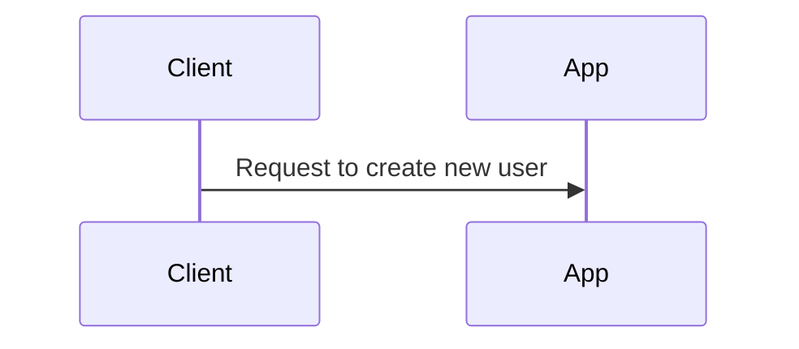

Input:

```typescript
class Worker {
  /// [](Worker) Consume from RabbitMQ
  onUserCreated(user: User) {
    /// "$" <= "RabbitMQ": Consume queue user.created

    /// "$" > "$": Print user data
    console.log(user)
    ...
  }
}
```

Output:  
File `Consume from RabbitMQ.md` will be generated


## Reference function
Define a function which will be called in other funtions  
- Ref to steps in this function
  ```text
    [Function_Name]
  ```
- Create a group contains steps in this function
  ```text
    [Function_Name] Description
  ```

### Example

Input:

```typescript
class UserController {

  /// [](App) Create a new user
  async createUser() {

    /// [requestClass] 
    await this.requestClass()

    /// [requestUser] This function handle user creating
    await this.requestUser()
  }

  /// [requestClass] 
  private requestClass() {
    /// "Client" => "$": Request to create a new class
  }

  /// [requestUser]
  private requestUser() {
    /// "Client" => "$": Request to create a new user
  }
}

```

Output:

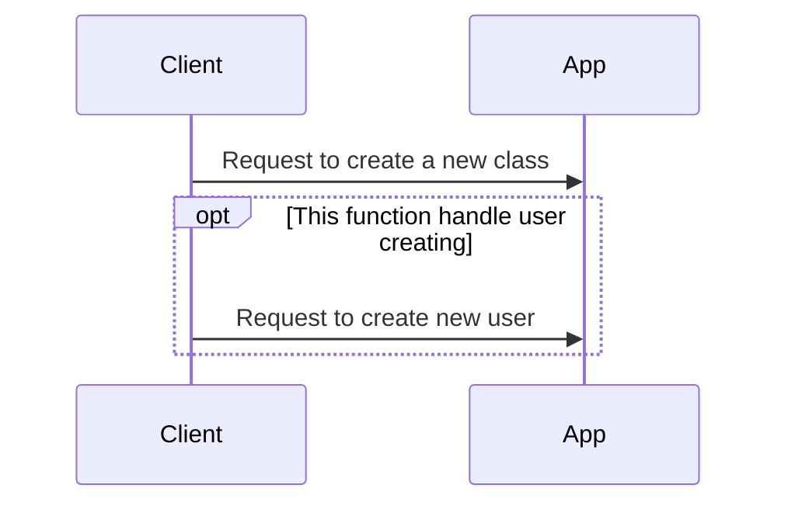

## Requests
Describle a request to other services. (HTTP requests, grpc requests...)  
- Service1 send a request(http, grpc...) to Service2(Other Services)
  ```text
    "Service1" => "Service2: Description"
  ```

- After Service2(Other Services) done, it response to Service1
  ```text
    "Service1" <= "Service2: Description"
  ```

### Example:

Input:

```typescript
class PostController {
  createPost(post: Post) {
    /// "Client" => "$": Create a new post

    /// "$" => "PostService": Create a new post
    this.postService.create(post)
    /// "$" <= "PostService": Return Post
    
    /// "Client" <= "$": Response 200
  }
}

```

Output:

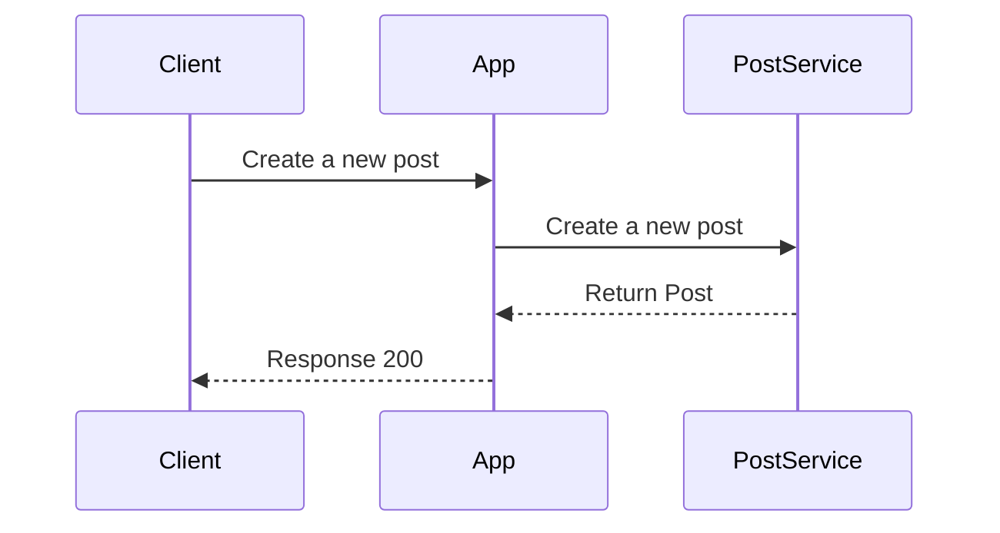

## Actions
Describle synchronized actions. (Insert into DB, Push a cache to redis...)  
- Service1 call Component1(DB, itself...) to do something
  ```text
    "Service1" > "Component1": Description
  ```
- After Component1(DB, itself...) done, it returns something to Service1
  ```text
    "Service1" < "Component1": Description
  ```

Example:

Input: 

```typescript
class PostService {
  createPost(post: Post) {
    /// "MyService" > "MongoDB": Create a new post
    await this.mongoDB.insert(post)
    /// "MyService" < "MongoDB": Done

    /// "MyService" > "Redis": Push post to cached
    await this.redis.push(post)
    /// "MyService" < "Redis": Done
  }
}

```

Output:

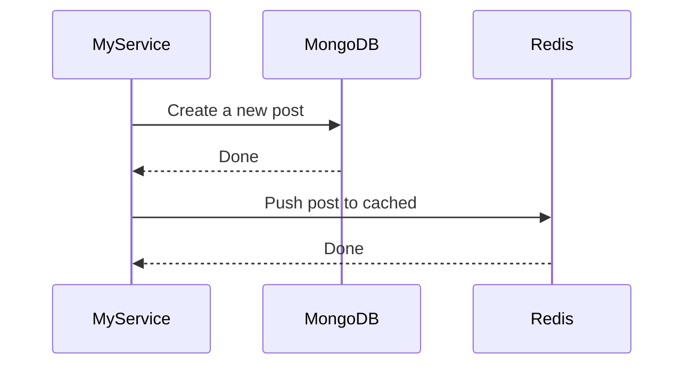

## Publisher
Publish an async event via RabbitMQ, Kafka, Queue...  
- Service1 publish/emit data to Component1(MessageQueue, EventEmiter...) to do something
  ```text
    "Service1" -> "Component1": Description
  ```

### Example:

Input: 

```typescript

class GlobalEvent {
  postCreated(post: Post) {
    /// "$" -> "RabbitMQ": Emit "post.created"
    await this.rabbitMQ.publish('post.created', post)

    /// "$" -> "$": Emit "internal.post_created"
    await this.event.emit('internal.post_created', post)
  }
}
```

Output:

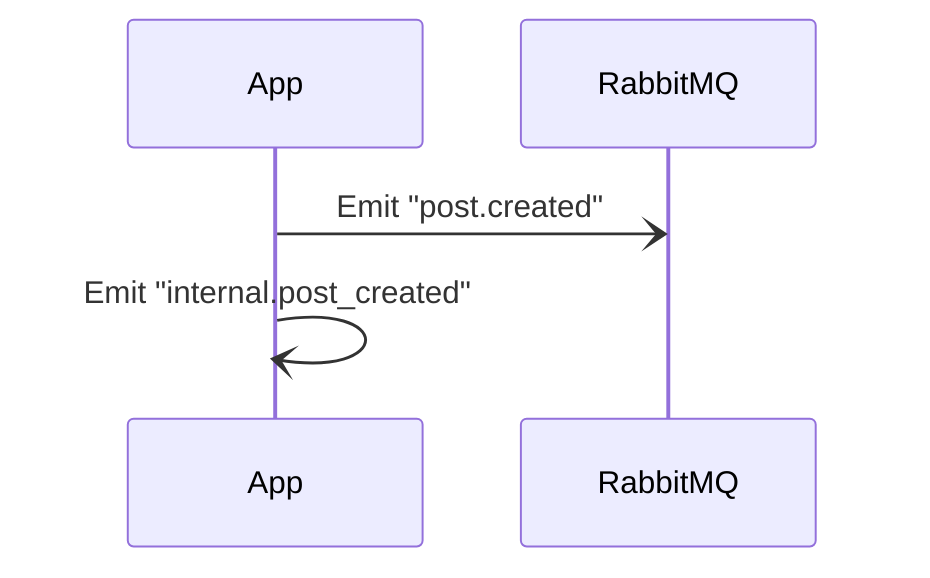

## Subscriber
Subscribe a queue in RabbitMQ, kafka, global event... to receive data  
- Service1 subscribe/on data from Component1(MessageQueue, EventEmiter...) to do something
  ```text
    "Service1" <- "Component1": Description
  ```

### Example

Input:

```typescript

class GlobalEvent {

  /// [] Subscribe from global
  onGlobalPostCreated(post: Post) {
    /// "$" <- "RabbitMQ": Subscribe queue "post.created"
  }

  /// [] Subscribe from internal
  onInternalPostCreated(post: Post) {
    /// "$" -> "$": Subscribe internal queue "internal.post_created"
  }
  
}
```

Output:


File `Subscribe from global.md`

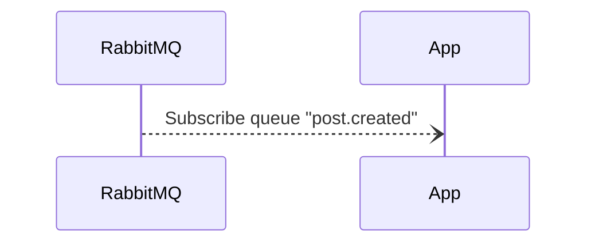

File `Subscribe from internal.md`

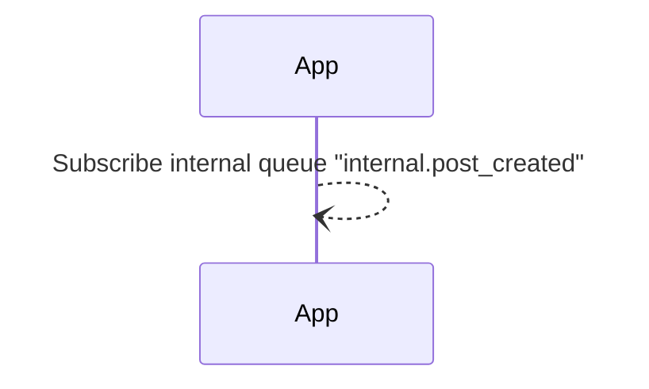

## Conditional
Describe If then else then...  
```text
IF Condition1
  ...
ELSE IF Condition2
  ...
ELSE Condition3
  ...
```

```typescript
class UserController {
  createUser() {
    /// "Client" => "$": Send a request

    /// IF Request is not authenticated
    if (!this.auth.validate()) {
      /// "Client" <= "$": Response 401
      throw new HttpError(401)
    }
    /// ELSE IF Request is not valid
    else if(!this.validate()) {
      /// "Client" <= "$": Response 400
      throw new HttpError(400)
    }
    /// ELSE
    else {
      /// "$" > "$": Do something...
      ...
      /// "Client" <= "$": Response 200
      return ""
    }
  }
}

```

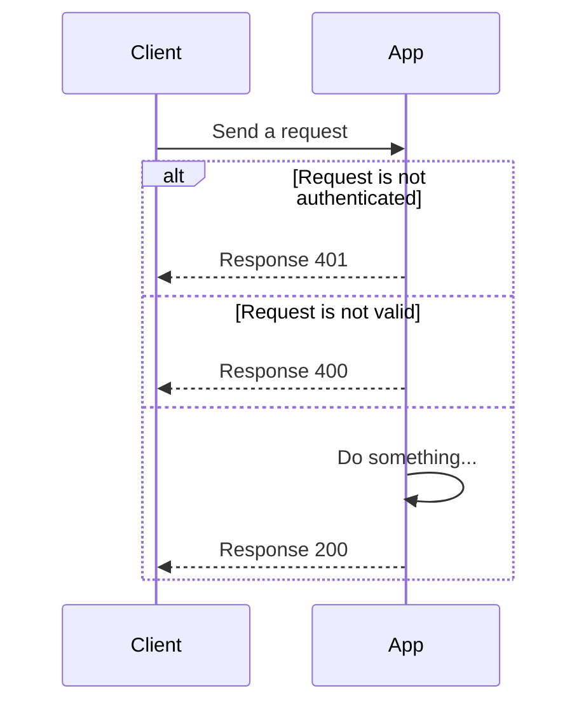

## Group
Group of sequence steps  
```text
GROUP Description
  ...
```

```typescript
class AuthService {
  
  request() {
    /// GROUP Validate request
    function validate() {
      /// "Client" => "AuthService": Validate request
      this.authService.validate()
      /// "Client" <= "AuthService": Response 200
    }
    validate()
  }
}

```

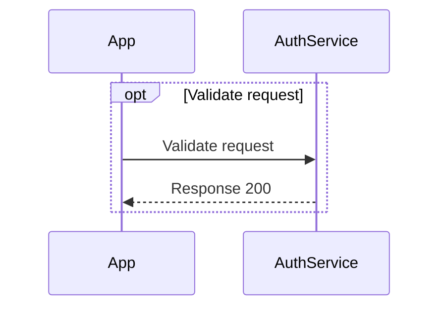

## Loop
Scan all of items in list  
```text
LOOP Items
  ...
```

### Example

Input:

```typescript
class Product {
  scan(products: Product[]) {

    /// LOOP List products
    for (const product of products) {
      /// "App" => "ProductService": Get a product details
      const productInfo = await this.productService.get(product.id)
      /// "App" <= "ProductService": Response a product information
    }
  }
}
```

Output:

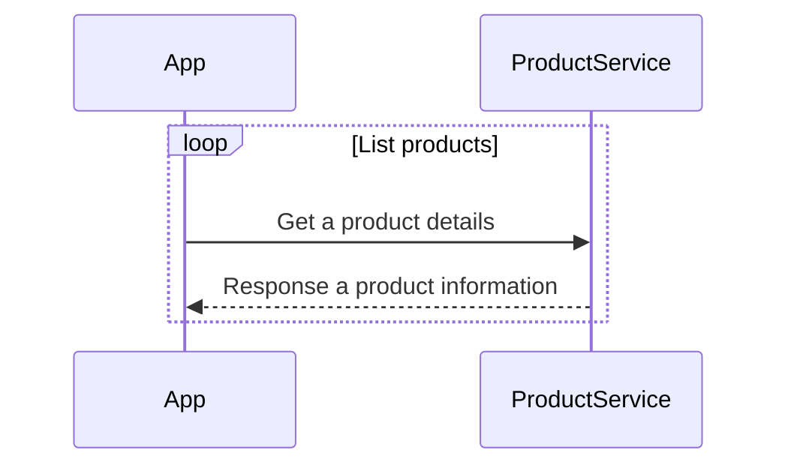

## Note
Add notes in diagram  
- Note a left of Service1
```text
NOTE LEFT OF "Service1": Description
```
- Note a right of Service2
```text
NOTE RIGHT OF "Service2": Description
```
- Note over Service1 and Service 2
```text
NOTE OVER "Service1", "Service2": Description
```

### Example

Input:

```typescript
class ServiceController {

  sendRequest() {
    /// NOTE LEFT OF "Service1": Note a left
    /// NOTE RIGHT OF "Service2": Note a right
    /// NOTE OVER "Service1", "Service2": Note over all
  }
}
```

Output:

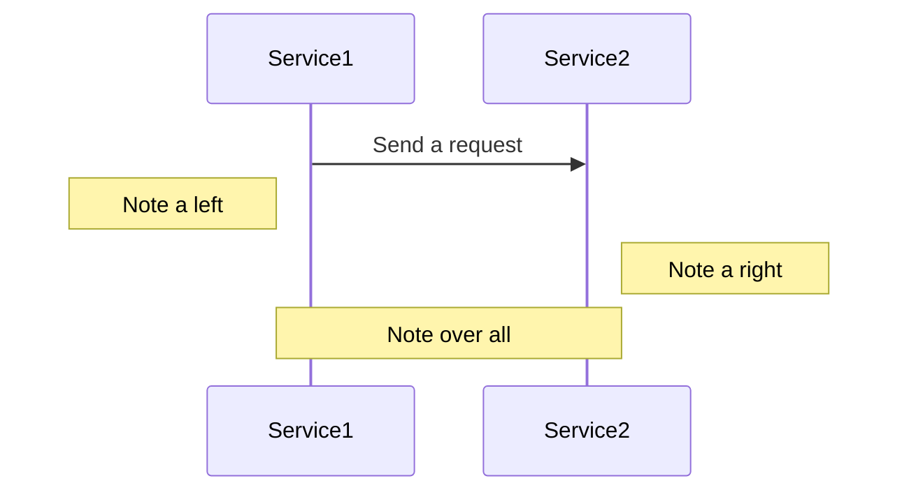

## Parallel
Describle parallel jobs  
```text
PAR Job1
  ...
AND Job2
  ...
```

### Example

Input:

```typescript
class Login {
  login() {
    Promise.all([
      /// PAR Login user
      ///   "App" => "AuthService": Send a login request
      this.authService.login(),

      /// AND Emit an event to globals 
      ///   "App" -> "RabbitMQ": Emit "user.login"
      this.rabbitMQ.publish()
    ])
  }
}
```

Output: 

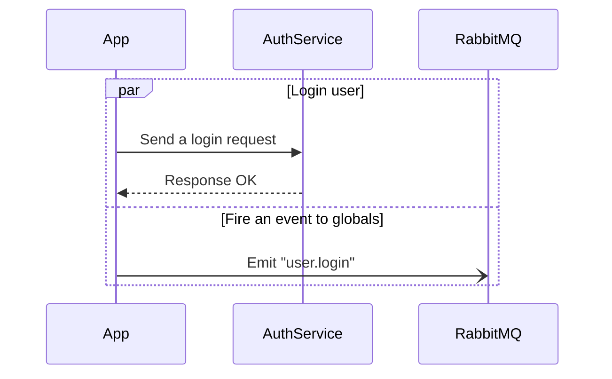

Input

```typescript
class Login {
  login() {
    /// PAR
    Promise.all([
      /// [login] Login user
      this.authService.login(),
      /// [publishUserLogin] Emit an event to globals 
      this.publishUserLogin()
    ])
  }

  /// [login]
  private login() {
    /// "App" => "AuthService": Send a login request
    this.authService.login(),
  }

  /// [publishUserLogin]
  private publishUserLogin() {
    /// "App" -> "RabbitMQ": Emit "user.login"
    this.rabbitMQ.publish()
  }
}
```

Output: 


