# Document
*Describe all of elements in tool. (meaning, how to use...)*
| Element | Description |  
|---|---|  
| DOC | --- |
|[yas-sequence-diagram~SequenceDiagram](#yas-sequence-diagram~SequenceDiagram)| Auto extract comment line in code to sequence diagrams|  
  
  
# Details
## yas-sequence-diagram~SequenceDiagram <a name="yas-sequence-diagram~SequenceDiagram"></a>
Auto extract comment line in code to sequence diagrams  

```yaml
- yas-sequence-diagram~SequenceDiagram:
    commentTag: ///             # Prefix each of line which will be handled to document (optional)
                                # Default: 
                                # .js, .ts, .go, .java is ///
                                # .py, .yaml is #/
                                # others must be set before run

    includes: ["src"]           # All of files in these path will be scanned (required)

    excludes: []                # All of files in these path will be ignored (optional)
                                # Default:
                                # .js, .ts is ['node_modules', 'dist']
                                # .java is ['bin', 'build']
                                # .py is ['__pycache__']

    includePattern: ".+\\.ts$"  # Files matched this pattern will be handled (required)

    outDir: /sequence_diagram   # Output directory which includes sequence diagrams
```


  
# Guide
How to used comment to generate to sequence diagram  
- Example at [here](./test/resources/)
- Output sequence diagram at [here](./test/resources/result/README.md)  


## Startup function
Each of startup function will be generate to a single sequence diagram file  
```typescript
/// [](App) Create a new user
///   "Client" => "$": Request to create new user
```

File `Create a new user.md`
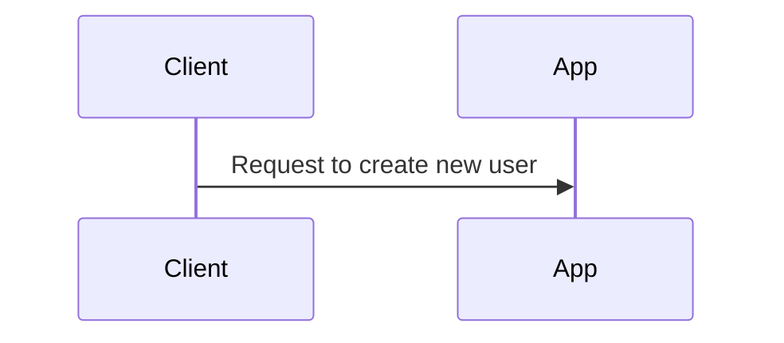

```typescript
/// [](Worker) Consume from RabbitMQ
///   "$" <= "RabbitMQ": Consume queue user.created
///   "$" > "$": Do something here
```

File `Consume from RabbitMQ.md`
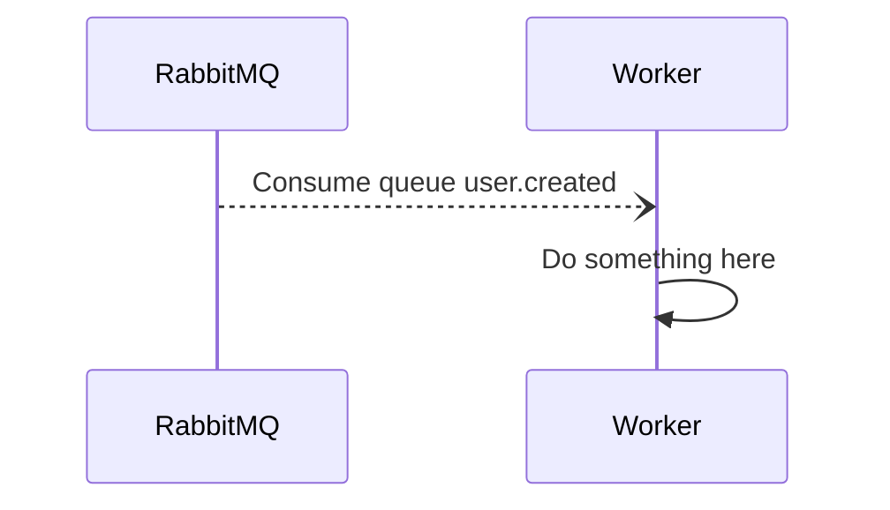

## Reference function
Define a function which will be called in other funtions  
```typescript
/// [](App) Create a new user
///   GROUP Reference to requestUser
///     [requestUser]

/// [requestUser]
///   "Client" => "$": Request to create new user
```

File `Create a new user.md`


## Requests
Describle a request to other services.  
Example: HTTP requests, grpc requests...  
```typescript
/// NOTE OVER "Client", "App": Client send a request to App to create a new post

/// "Client" => "App": Create a new post
/// "Client" <= "App": Response 200
```

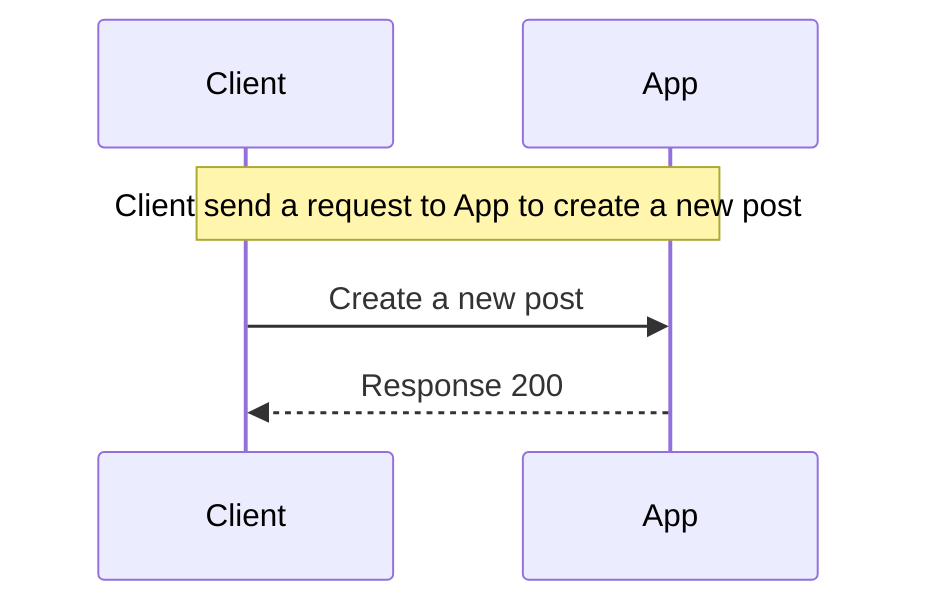

## Actions
Describle synchronized actions.  
Example: Insert into DB, Push a cache to redis...  
```typescript
/// NOTE OVER "MyService", "MongoDB": App create a new post into MongoDB

/// "MyService" > "MongoDB": Create a new post
/// "MyService" < "MongoDB": Done

/// NOTE OVER "MyService", "Redis": App push a new post into Redis cached

/// "MyService" > "Redis": Push post to cached
/// "MyService" < "Redis": Done
```

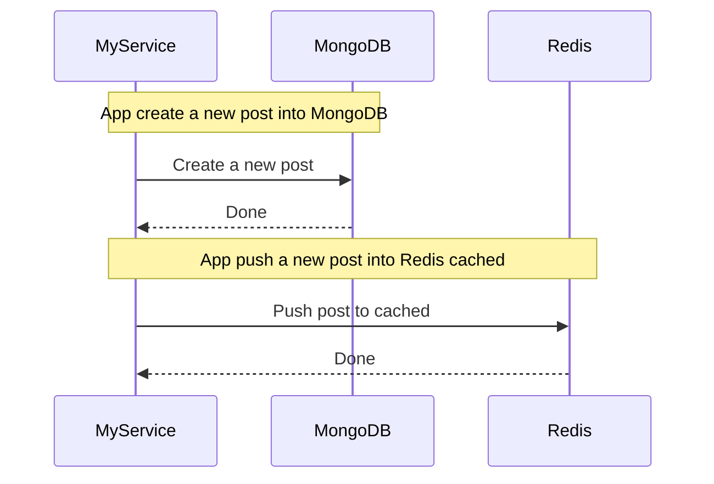

## Publisher
Publish an async event via RabbitMQ, Kafka, Queue...  
```typescript
/// NOTE OVER "App", "RabbitMQ": App publish to RabbitMQ after creating done

/// "App" -> "RabbitMQ": Emit "post.created"

/// NOTE OVER "App", "App": App emit an event to global events

/// "App" -> "App": Emit "internal.post_created"
```

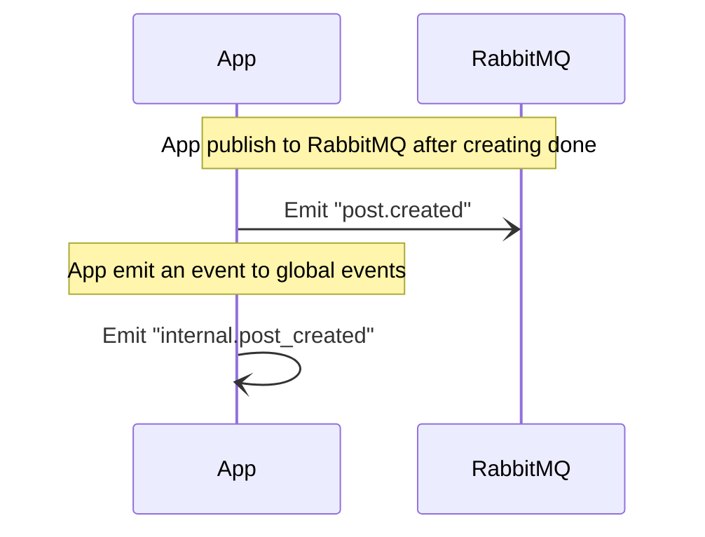

## Subscriber
Subscribe a queue in RabbitMQ, kafka, global event... to receive data  
```typescript
/// NOTE OVER "App", "RabbitMQ": App subscribe from RabbitMQ after creating done

/// "App" <- "RabbitMQ": Subscribe queue "post.created"

/// NOTE OVER "App", "App": App subscribe from global events

/// "App" -> "App": Subscribe internal queue "internal.post_created"
```

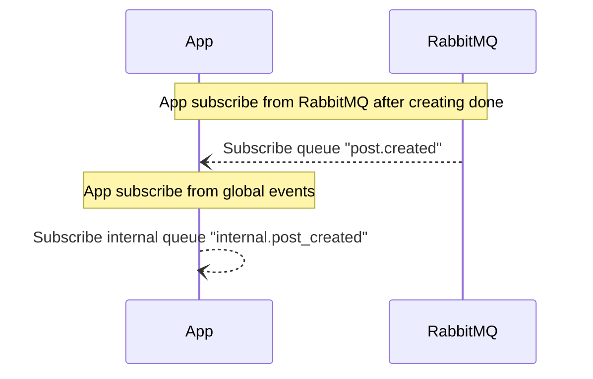

## Conditional
Describe If then else then...  
```typescript
/// "Client" => "App": Send a request
/// IF Request is not authenticated
///   "Client" <= "App": Response 401
/// ELSE IF Request is not valid
///   "Client" <= "App": Response 400
/// ELSE
///   "App" > "App": Do something...
///   "Client" <= "App": Response 200
```

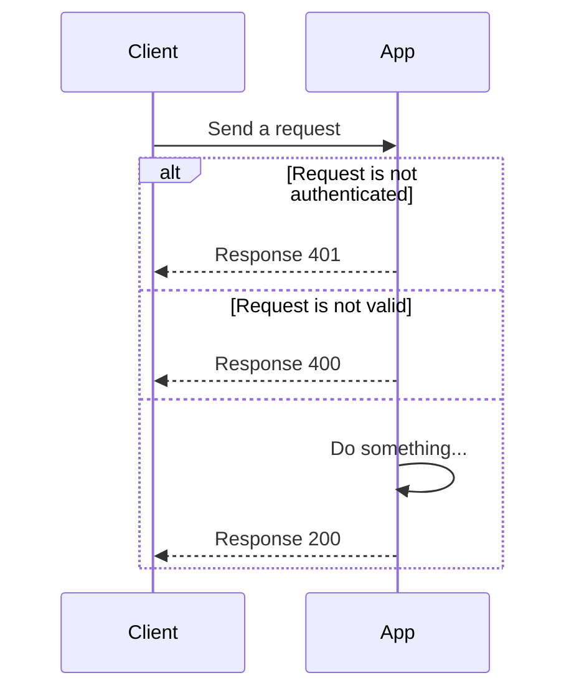

## Group
Group of sequence steps  
```typescript
/// "Client" => "App": Send a request

/// GROUP Validate request
///   "Client" => "AuthService": Validate request
///   "Client" <= "AuthService": Response 200
```

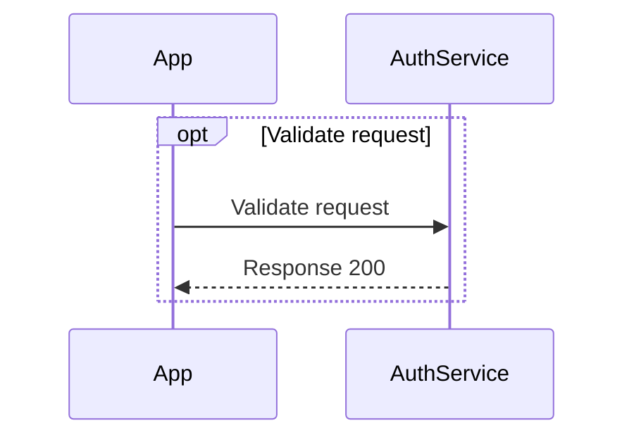

## Loop
Scan all of items in list  
```typescript
/// LOOP List products
///   "App" => "ProductService": Get a product details
///   "App" <= "ProductService": Response a product information
```

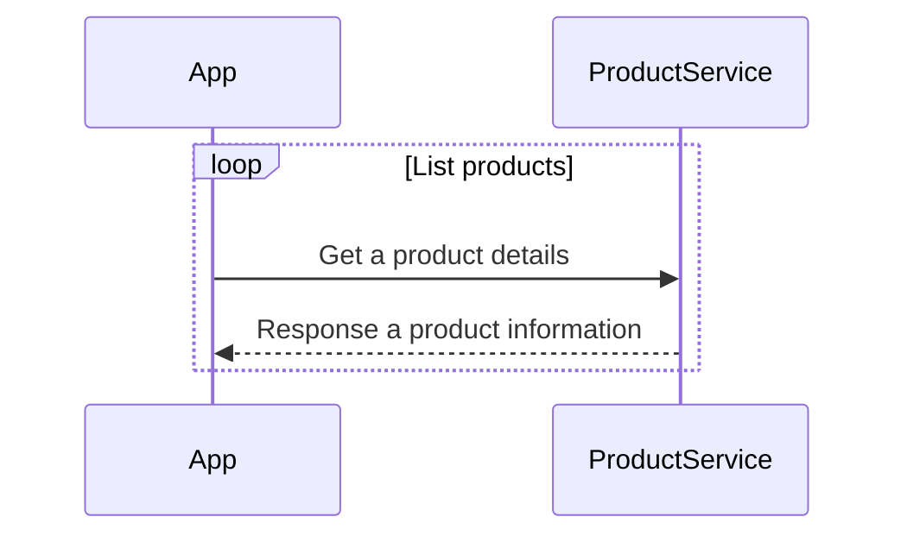

## Note
Add notes in diagram  
```typescript
/// "User" => "Service": Send a request

/// NOTE LEFT OF "User": Note a left
/// NOTE RIGHT OF "User": Note a right
/// NOTE OVER "User", "Service": Note over all
```

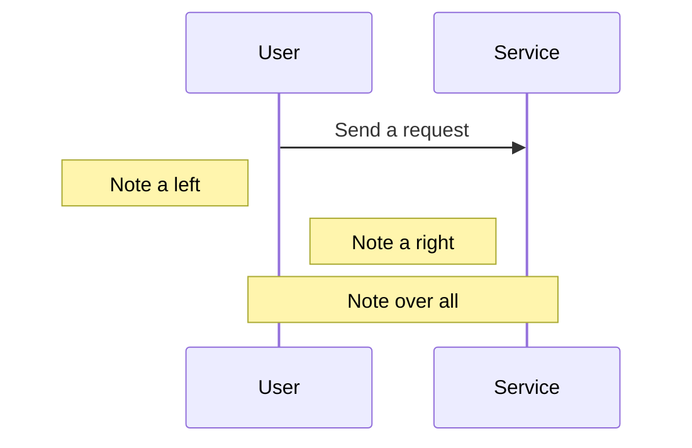

## Parallel
Describle parallel jobs  
```typescript
/// PAR Login user
///   "App" => "AuthService": Send a login request
/// AND Emit an event to globals 
///   "App" -> "RabbitMQ": Emit "user.login"
```

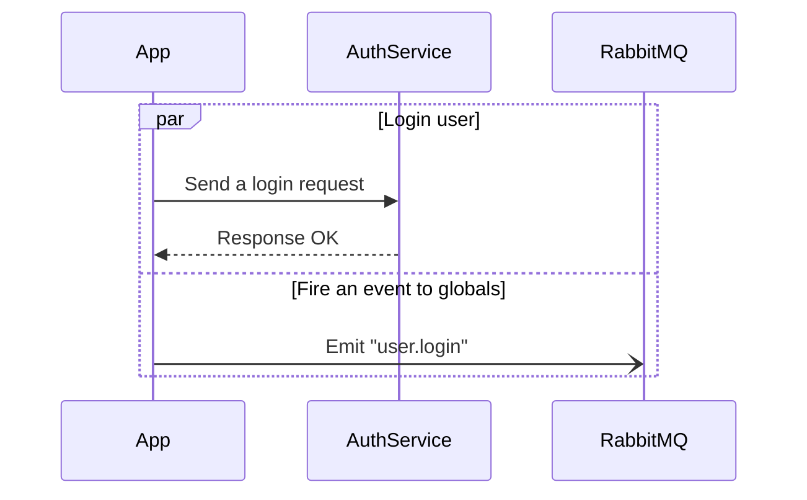
