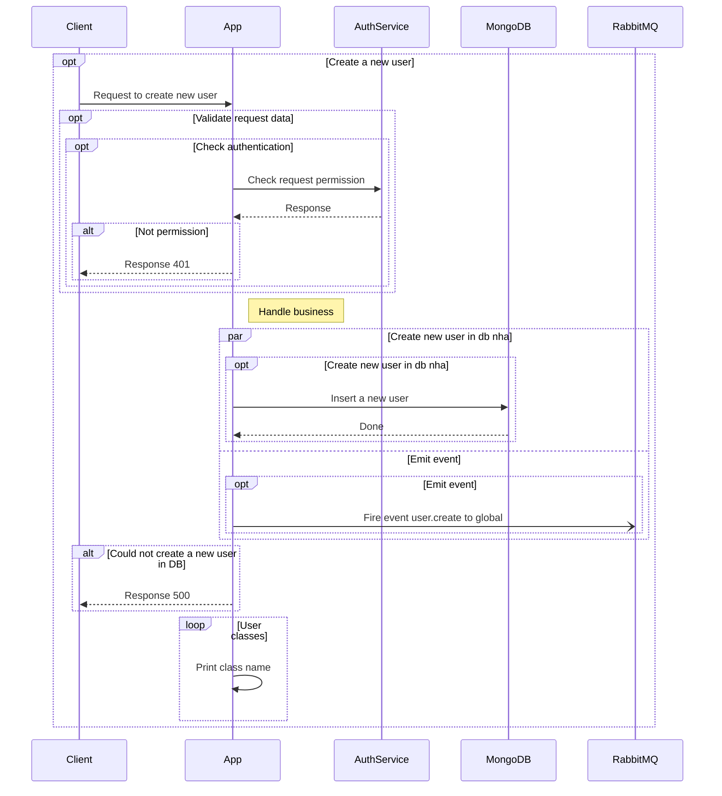

# Create a new user

```mermaid
sequenceDiagram

%% []
OPT Create a new user
Client ->> App: Request to create new user
OPT Validate request data
  %% [UserController.validateRequest]
  %% [AuthService.checkAuth]
  OPT Check authentication
    App ->> AuthService: Check request permission
    AuthService -->> App: Response
    ALT Not permission
      App -->> Client: Response 401
    END
  END
END
NOTE RIGHT OF App: Handle business
%% [UserService.createNewUser]
PAR Create new user in db nha
  %% [UserService.createUserInDB]
  OPT Create new user in db nha
  App ->> MongoDB: Insert a new user
  MongoDB -->> App: Done
  END
AND Emit event
  %% [UserService.emitCreateUserEvent]
  OPT Emit event
  App -) RabbitMQ: Fire event user.create to global
  END
END
ALT Could not create a new user in DB
  App -->> Client: Response 500
END
LOOP User classes
  App ->> App: Print class name
END
END
```
