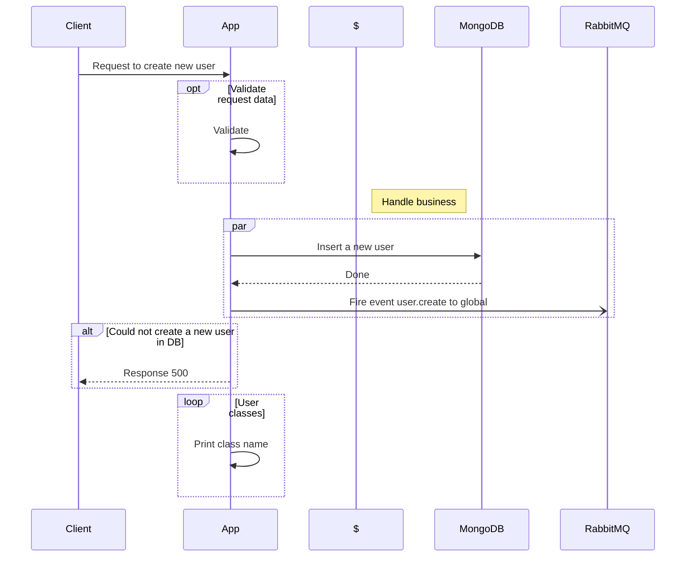

# Create a new user

```mermaid
sequenceDiagram

%% [] Create a new user
Client ->> App: Request to create new user
OPT Validate request data
  App ->> App: Validate
END
NOTE RIGHT OF $: Handle business
%% [UserService.createNewUser] 
PAR 
  %% [UserService.createUserInDB] 
  App ->> MongoDB: Insert a new user
  MongoDB -->> App: Done
  %% [UserService.emitCreateUserEvent] 
  App -) RabbitMQ: Fire event user.create to global
END
ALT Could not create a new user in DB
  App -->> Client: Response 500
END
LOOP User classes
  App ->> App: Print class name
END
```
