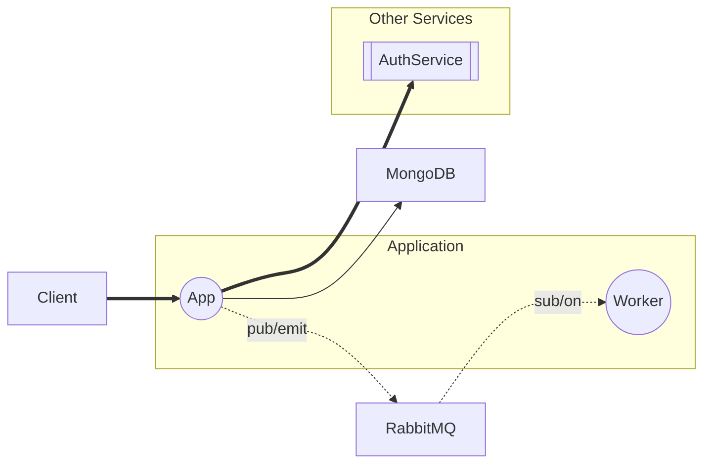

# Application document details
## System overview
Describe all of components in application

## Main flows
Visualize flows in application to sequence diagrams

1. [Create a new user](./Create%20a%20new%20user.md)
2. [Worker listen event user.created](./Worker%20listen%20event%20user.created.md)
